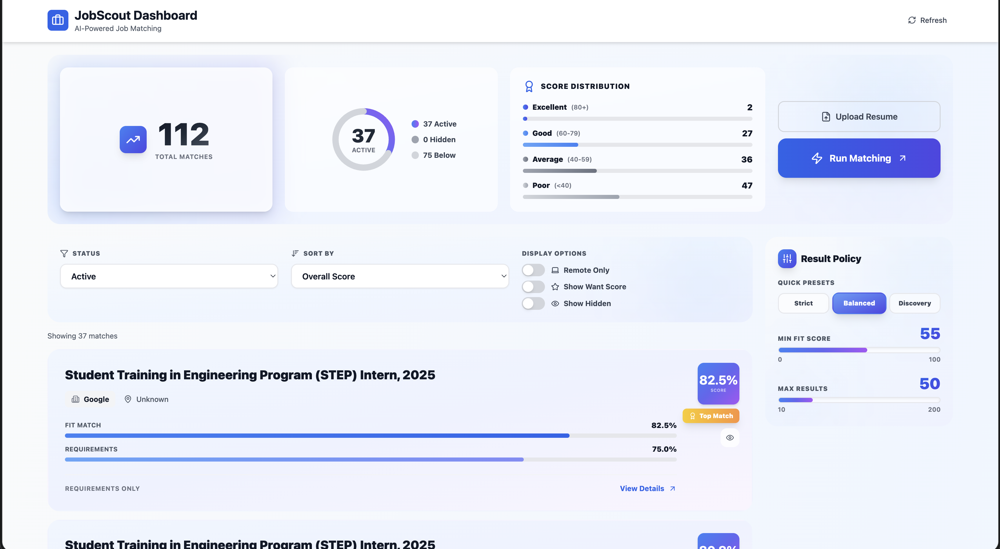

# JobScout

AI-powered job matching pipeline that scrapes, analyzes, and matches jobs to your resume and preferences.

## Features

- **ETL Pipeline**: Scrapes jobs from multiple sources (LinkedIn, Indeed, Glassdoor, TokyoDev, JapanDev)
- **AI Analysis**: Uses local LLMs (Ollama) for job extraction and semantic matching
- **Vector Search**: pgvector for similarity matching between your skills and job requirements
- **Dashboard**: Web interface to browse matches, view stats, and configure notifications

## Quick Start

### Prerequisites

- **Python 3.11+** and **uv** (package manager)
- **Docker** (for PostgreSQL, Redis, Ollama)
- **Node.js 18+** (for frontend)

### First-Time Setup

```bash
# 1. Install dependencies
uv sync --all-groups
cd web/frontend && npm install && cd ../..

# 2. Set up your configuration files
cp resume.example.json resume.json
cp .env.example .env
# Edit resume.json with your actual resume data
# Edit .env with your notification settings (e.g., Discord webhook)

# 3. (Optional) Add your job preferences
cp wants.example.txt wants.txt
# Edit wants.txt - one preference per line in natural language
# Then uncomment user_wants_file in config.yaml
```

### Start Everything

```bash
# Start Docker services + Backend + Frontend
./scripts/setup_local_env/start.sh --docker --backend --frontend

# Or start with logs visible (blocks terminal):
./scripts/setup_local_env/start.sh --docker --backend --frontend --block
```

**Access the app:**
- Frontend: http://localhost:5173
- Backend API: http://localhost:8080
- API Docs: http://localhost:8080/docs

### View Logs

```bash
# Show last 50 lines of all logs
./scripts/setup_local_env/logs.sh

# Follow logs in real-time
./scripts/setup_local_env/logs.sh -f

# Specific service logs
./scripts/setup_local_env/logs.sh backend    # Backend only
./scripts/setup_local_env/logs.sh frontend   # Frontend only
```

## Manual Startup

### 1. Start Docker Services

```bash
# Start PostgreSQL, Redis, and optionally Ollama
docker-compose up -d

# With Ollama
docker-compose --profile docker-ollama up -d
```

### 2. Start Backend (FastAPI)

```bash
# Install dependencies
uv sync --group web

# Start server
uv run python -m uvicorn web.backend.app:app --host 0.0.0.0 --port 8080
```

**Endpoints:**
- Dashboard: http://localhost:8080
- API Docs: http://localhost:8080/docs

### 3. Start Frontend (Vite)

```bash
cd web/frontend
npm install  # First time only
npm run dev
```

**Frontend:** http://localhost:5173 (proxies API to localhost:8080)

## Running the Pipeline

### Option A: Batch Pipeline (Main Driver)

Runs ETL → Matching cycles on a schedule:

```bash
# Full pipeline (ETL + Matching)
uv run python main.py

# ETL only
uv run python main.py --mode etl

# Matching only
uv run python main.py --mode matching
```

### Option B: Manual Pipeline Trigger

Use the dashboard or API to trigger pipelines manually:

```bash
# Start pipeline
curl -X POST http://localhost:8080/api/pipeline/start

# Check status
curl http://localhost:8080/api/pipeline/status
```

## Configuration

Edit `config.yaml` to customize:

- **Scrapers**: Add/modify job sources in `scrapers:`
- **Schedule**: Change pipeline interval in `schedule.interval_seconds:`
- **Matching**: Adjust weights in `matching.scorer:`
- **Notifications**: Configure in `notifications:`

## Project Structure

```
jobscout/
├── scripts/
│   └── setup_local_env/     # Startup scripts and logs
│       ├── start.sh         # Main startup script
│       ├── logs.sh          # Log viewing utility
│       └── logs/            # Log files (auto-created)
│           ├── backend.log
│           └── frontend.log
├── config.yaml              # Application configuration
├── docker-compose.yml       # Docker services
├── main.py                  # Batch pipeline driver
├── core/                    # Core services (AI, matching, scoring)
├── database/                # SQLAlchemy models and DB logic
├── etl/                     # Extract-Transform-Load pipeline
├── pipeline/                # Matching pipeline
├── notification/            # Notification workers
└── web/                     # Web dashboard
    ├── backend/             # FastAPI backend
    └── frontend/            # React frontend
```

## Screenshots

_Coming soon: Dashboard screenshots and demo video_

## Dependencies

- **Python 3.13+**
- **uv**: Package manager
- **Docker**: PostgreSQL, Redis, Ollama
- **Node.js 18+**: For frontend development

## License

GNU Affero General Public License v3.0
