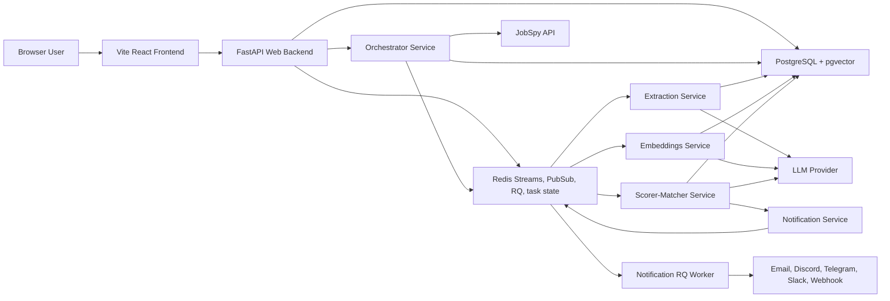
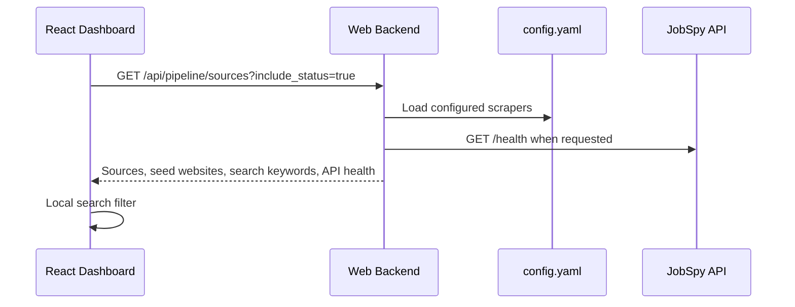
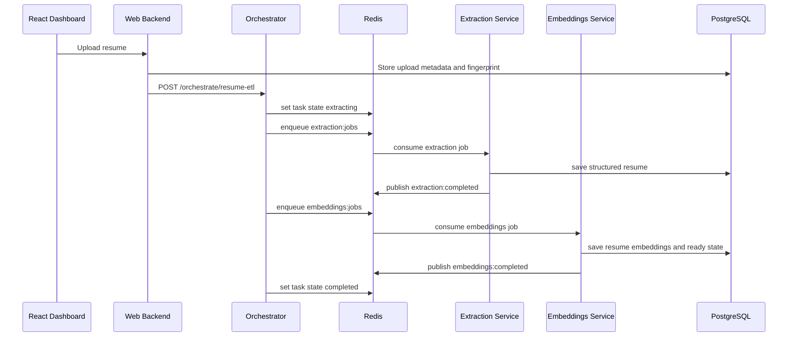
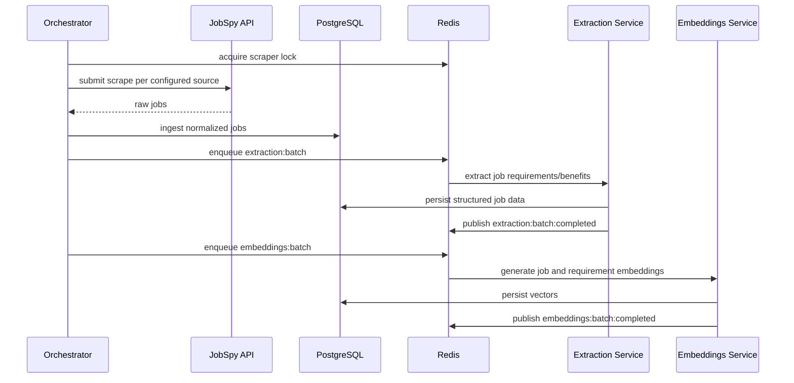
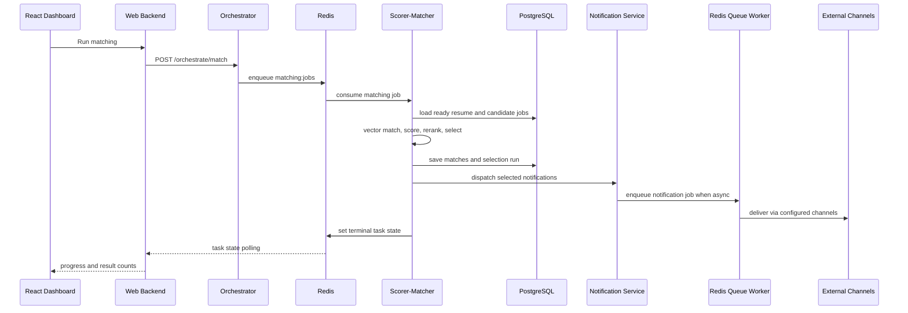

# JobScout Current Architecture Spec

Last updated: 2026-05-17

This document describes the current runtime architecture as implemented in the repository. It focuses on component boundaries, data flow, and the connections between the web UI, backend API, microservices, queues, persistence, external fetchers, and notification delivery.

## System Context

JobScout is a job ingestion, resume processing, matching, scoring, and notification system. The core runtime is a FastAPI web backend plus worker-oriented FastAPI microservices connected through PostgreSQL and Redis.

## Primary Runtime Components

### Frontend

Path: `web/frontend/src`

Responsibilities:
- React dashboard, match list, filters, policy controls, candidate preferences, notification settings, and resume upload controls.
- Calls `web/backend` APIs through service modules in `web/frontend/src/services`.
- Tracks long-running pipeline status through polling/hooks and renders task progress.
- Displays configured fetch sources and JobSpy availability.

Recent performance behavior:
- `FetchSourcesPanel` fetches source metadata once with API health and filters locally during search. This avoids re-running API health checks on every keystroke.

### Web Backend

Path: `web/backend`

Responsibilities:
- Serves the SPA shell at `/`, `/dashboard`, and `/verify-email`.
- Serves API routers for matches, stats, policy, pipeline, notifications, and candidate preferences.
- Provides auth/user dependency resolution, including local dev-bypass behavior.
- Uses singleton HTTP clients for internal microservice calls.
- Reads and writes PostgreSQL through repository/UoW patterns.
- Reads and writes Redis task state for pipeline status.

Recent performance behavior:
- Dashboard HTML reads are cached by path, mtime, and size. Normal dashboard navigation no longer reads `index.html` from disk for every request, while still refreshing after frontend rebuilds.

Key routers:
- `web/backend/routers/pipeline.py`: pipeline control, task status, source discovery, scraper/API metadata.
- `web/backend/routers/matches.py`: match listing and match-state operations.
- `web/backend/routers/stats.py`: dashboard metrics.
- `web/backend/routers/policy.py`: ranking/result policy configuration.
- `web/backend/routers/notifications.py`: notification settings, verification, and tests.
- `web/backend/routers/candidate_preferences.py`: candidate preference CRUD and ranking inputs.

### Orchestrator Service

Path: `services/orchestrator/main.py`

Responsibilities:
- Coordinates scrape, extraction, embeddings, and matching stages.
- Enqueues Redis Stream jobs and listens for Redis PubSub completion events.
- Maintains task state snapshots in Redis under `task:{task_id}:state`.
- Hosts status and diagnostics endpoints.
- Runs the scheduled scraper loop unless disabled by config.
- Uses distributed Redis locks for per-source scraper execution.

Recent performance behavior:
- Diagnostics use bounded `SCAN` iteration instead of Redis `KEYS("task:*:state")`, preventing full keyspace scans on production Redis.

Important endpoints:
- `POST /orchestrate/match`
- `POST /orchestrate/resume-etl`
- `POST /orchestrate/stages/{stage}`
- `POST /orchestrate/pipelines/scrape-extract-embed`
- `GET /orchestrate/tasks/{task_id}`
- `GET /orchestrate/diagnostics`
- `POST /orchestrate/stop`

### Extraction Service

Path: `services/extraction/main.py`

Responsibilities:
- Consumes `extraction:jobs` for resume extraction.
- Consumes `extraction:batch` for queued job-description extraction.
- Validates resume file paths before processing.
- Uses `JobETLService` and LLM extraction to create structured job/resume data.
- Publishes completion events on `extraction:completed` and `extraction:batch:completed`.

### Embeddings Service

Path: `services/embeddings/main.py`

Responsibilities:
- Consumes `embeddings:jobs` for resume embeddings.
- Consumes `embeddings:batch` for job/requirement embeddings.
- Generates embeddings through the configured LLM provider.
- Persists vectors in PostgreSQL/pgvector tables.
- Publishes completion events on `embeddings:completed` and `embeddings:batch:completed`.

### Scorer-Matcher Service

Path: `services/scorer_matcher`

Responsibilities:
- Consumes `matching:jobs`.
- Loads the target resume by fingerprint or the latest ready resume.
- Runs vector matching, semantic scoring, policy-based selection, preference reranking, match persistence, and notification dispatch.
- Uses Redis cancellation flags for graceful stop support.
- Emits canonical task state transitions and terminal results.

Performance-sensitive behaviors:
- Local cross-encoder warm-up happens on service startup when enabled.
- Evidence reranking and semantic scoring share the local cross-encoder provider to avoid loading large model weights twice.
- Match save operations use per-match transactions so one failed save does not roll back the full run.

### Notification System

Paths: `notification`, `web/backend/routers/notifications.py`

Responsibilities:
- Stores per-user channel settings and verification/test state.
- Sends batch and match notifications via Email, Discord, Telegram, Slack, and Webhook channels.
- Deduplicates notifications through `NotificationTrackerService`.
- Uses Redis Queue when configured, with sync fallback when Redis/RQ is unavailable.
- Handles transient errors, rate limits, delayed retries, and failed-job visibility.

Recent reliability behavior:
- Dry-run mode avoids external delivery while still exercising resolution logic.
- Notification links use configured `base_url`.
- Recipient and webhook logging is masked.

### Persistence Layer

Paths: `database`, `migrations`

Responsibilities:
- SQLAlchemy ORM models for jobs, job sources, requirements, benefits, embeddings, resumes, matches, policies, notification settings, and delivery history.
- `JobRepository` contains query/update operations.
- `job_uow()` provides scoped repository access and transaction management.
- PostgreSQL with pgvector stores embeddings for similarity search.

Main persisted aggregates:
- Job posts and job content snapshots.
- Job source identities and dedupe fingerprints.
- Structured job requirements and benefits.
- Resume uploads, structured resumes, resume processing state, and resume embeddings.
- Job matches, match selection runs, policy snapshots, ranking snapshots.
- Notification settings, verification state, and delivery history.

### Redis Layer

Path: `core/redis_streams.py`, `core/stream_consumer.py`

Responsibilities:
- Connection pooling for synchronous Redis clients.
- Redis Streams for durable worker jobs.
- Redis PubSub for stage completion events.
- Redis string keys for task status, cancellation flags, and notification rate limits.
- Redis Queue for async notifications.

Streams and channels:
- Streams: `extraction:jobs`, `extraction:batch`, `embeddings:jobs`, `embeddings:batch`, `matching:jobs`
- Completion channels: `extraction:completed`, `extraction:batch:completed`, `embeddings:completed`, `embeddings:batch:completed`, `matching:completed`
- Task state keys: `task:{task_id}:state`
- Cancellation keys: `task:{task_id}:cancel_requested`

### Fetch Sources and JobSpy API

Paths: `config.yaml`, `core/scraper/jobspy_client.py`, `web/backend/routers/pipeline.py`

Responsibilities:
- `config.yaml` defines searchable fetch sources.
- `JobSpyClient` submits scrape requests and checks `/health`.
- Pipeline source API exposes seed websites, metadata, search keywords, and optional API health.
- The dashboard renders the searchable fetch queue.

Current configured sources:
- `tokyodev`: English-friendly software roles in Japan.
- `japandev`: Japan-focused developer roles with language and seniority filters.
- `indeed`: broad Tokyo software search via JobSpy.
- `glassdoor`: company and salary-aware listings via JobSpy.
- `linkedin`: professional network listings via JobSpy.

## Core Flows

### Source Discovery

### Resume Upload and Resume ETL

### Scheduled or Manual Job Ingestion

### Matching and Notifications

## Deployment and Containers

Docker Compose files define the local and test stacks:
- `docker-compose.base.yml`: shared infrastructure and defaults.
- `docker-compose.microservices.yml`: extraction, embeddings, matcher, orchestrator.
- `docker-compose.web.yml`: web backend and frontend-facing service wiring.
- `docker-compose.test.yml`: transient test PostgreSQL with pgvector.
- `docker-compose.e2e.yml`: end-to-end test composition.

Container hygiene:
- Test database storage is transient.
- Test containers are named explicitly.
- Test helpers remove stale stopped containers and use `--rm` where appropriate.

## Performance Notes and Current Hot Paths

Implemented in this pass:
- Source search is client-side after one health-aware source load, avoiding network and health-check churn while typing.
- SPA shell reads are cached until the underlying `index.html` changes.
- Redis diagnostics use bounded `SCAN` iteration instead of `KEYS`.

Existing performance safeguards:
- Redis uses a shared connection pool with timeouts.
- Redis Streams use max length trimming.
- Worker processing uses `asyncio.to_thread` around blocking CPU/IO work to keep service event loops responsive.
- Job and resume ETL uses fingerprinting to avoid repeated processing.
- Cross-encoder providers are warmed and shared where configured.
- Notification retries use delayed re-enqueue instead of sleeping RQ workers for long transient failures.

Recommended next performance work:
- Add database query-plan tests for match listing, source lookup, and ranking candidate queries.
- Add per-stage latency metrics to task state and Prometheus metrics.
- Consider batched match persistence for large selected match sets after measuring transaction overhead.
- Add stale task-state cleanup metrics and a background cleanup policy for old Redis task keys.
- Cache static source metadata in the backend if `config.yaml` reload becomes a measurable hot path.

